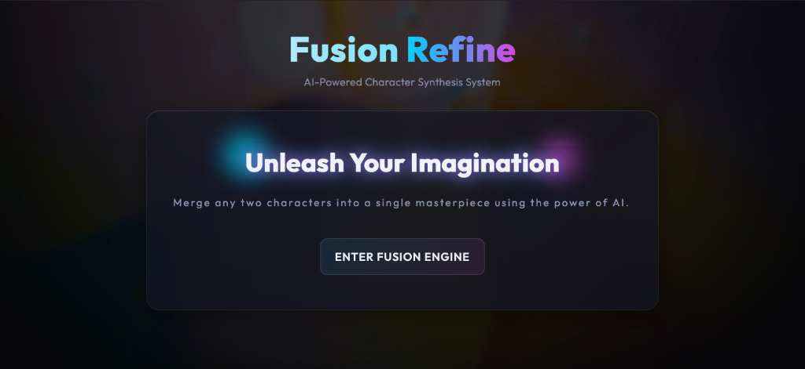
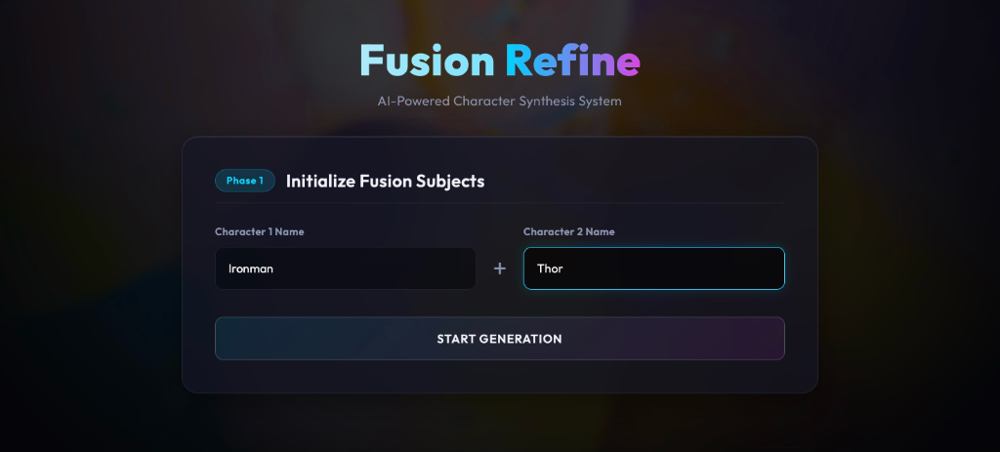
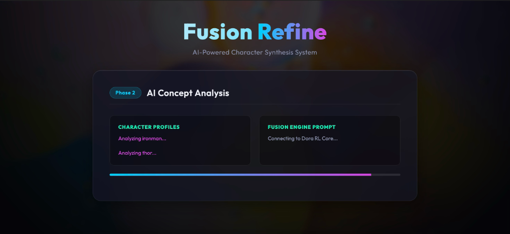
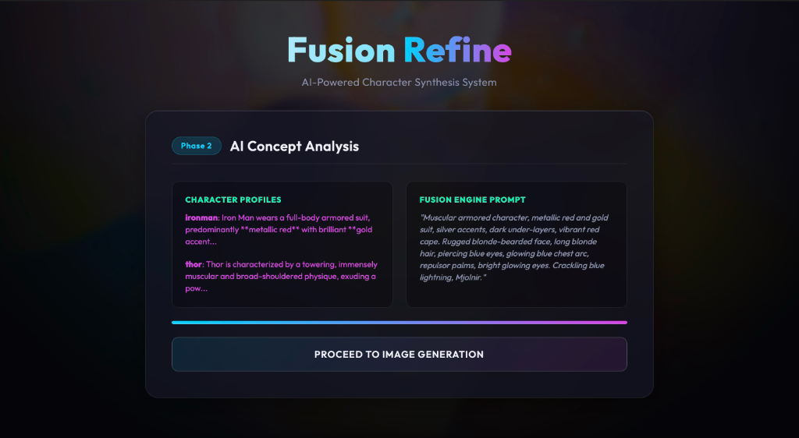
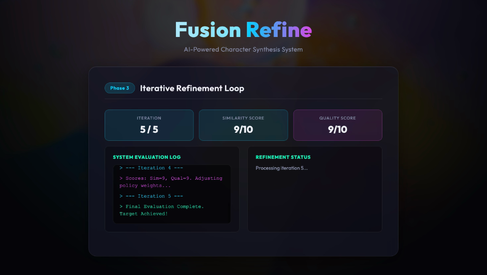

# Fusion Refine: Character Combiner

Fusion Refine is an AI-powered Character Synthesis System that takes two characters and merges them into a single masterpiece using the power of AI (Stable Diffusion and Dora RL Core).

## Screenshots

### Home Screen


### Phase 1: Initialize Fusion Subjects


### Phase 2: AI Concept Analysis



### Phase 3: Iterative Refinement Loop


## Running Locally

1. Create a virtual environment and install requirements:
   ```bash
   python3 -m venv .venv
   source .venv/bin/activate
   pip install -r requirements.txt
   ```
2. Start the web application:
   ```bash
   python app.py
   ```
3. The app will automatically open in your web browser at `http://127.0.0.1:5001`.
