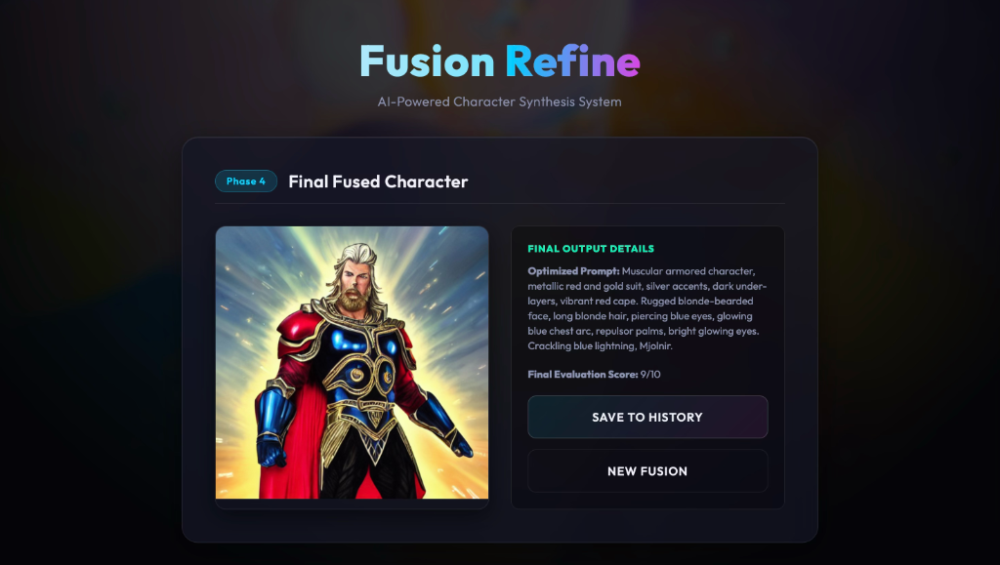
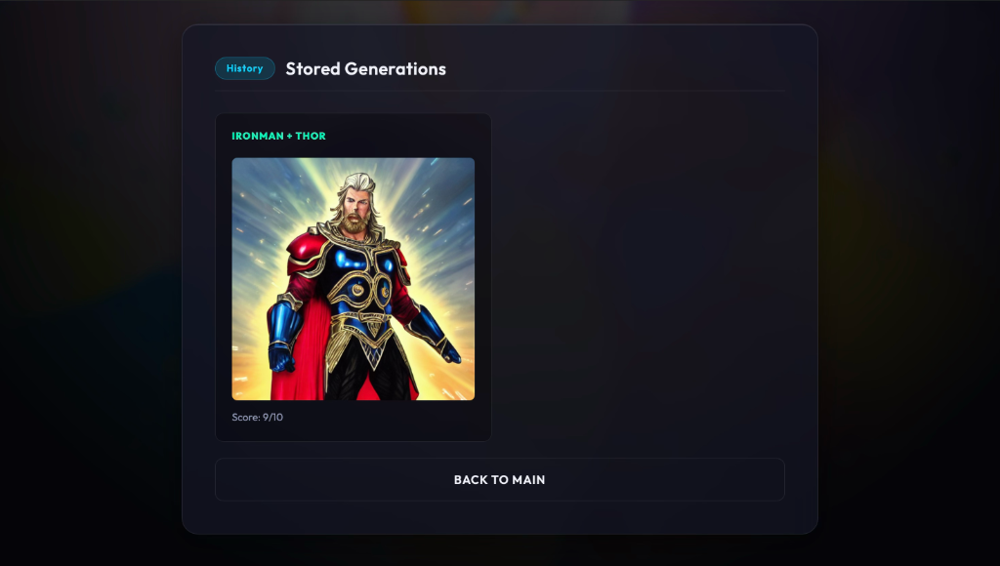

# Fusion Refine – AI Character Fusion & Refinement System

## Overview
Fusion Refine is an AI-powered image generation and refinement system that combines the characteristics of two different characters and generates unique hybrid outputs using Machine Learning and Generative AI techniques. The system evaluates generated images, improves prompts iteratively, and stores refined outputs for future reference.

This project demonstrates the practical implementation of:
- Machine Learning
- Prompt Engineering
- AI Image Generation
- Reinforcement Learning-inspired refinement
- Python-based automation workflows

---

## Features

- Character fusion using AI-generated descriptions
- Prompt refinement and optimization
- AI-based image generation
- Output evaluation and scoring system
- Iterative refinement process
- Output history and storage
- User-friendly interface

---

## Screenshots

### Home Screen


### Phase 1: Initialize Fusion Subjects


### Phase 2: AI Concept Analysis


### Phase 3: Iterative Refinement Loop


### Phase 4: Final Fused Character


### History: Stored Generations


---

## Technologies Used

- Python
- Machine Learning
- Generative AI
- Prompt Engineering
- Reinforcement Learning Concepts
- PIL / OpenCV
- Git & GitHub

---

## System Workflow

1. User enters two character names
2. AI fetches character descriptions
3. Descriptions are fused into a refined prompt
4. Image generation model creates hybrid output
5. Generated image is evaluated
6. Prompt is improved iteratively
7. Final output is stored

---

## Project Structure

```bash
Fusion-Refine/
│
├── agents.py
├── config.py
├── app.py
├── main.py
├── requirements.txt
├── README.md
├── outputs/
├── screenshots/
└── frontend/
```

---

## Installation

### Clone Repository

```bash
git clone https://github.com/mdsamariqbal/Fusion-Refine.git
```

### Move to Project Directory

```bash
cd Fusion-Refine
```

### Install Dependencies

```bash
pip install -r requirements.txt
```

---

## Run the Project

To run the web application interface:
```bash
python app.py
```
The app will automatically open in your web browser at `http://127.0.0.1:5001`.

To run the CLI version:
```bash
python main.py
```

---

## Example

### Input

```text
Character 1: Naruto
Character 2: Batman
```

### Output

- AI-generated fused character image
- Evaluation score
- Refined iterations

---

## Functional Requirements

- Character input system
- AI description generation
- Prompt fusion mechanism
- Image generation module
- Evaluation system
- Prompt refinement module
- Output storage

---

## Non-Functional Requirements

### Performance
- Fast image generation
- Efficient refinement handling

### Security
- Secure API handling
- Environment variable protection

### Usability
- Simple and user-friendly interface

---

## Future Scope

- Real-time generation
- Advanced RL-based optimization
- Multi-character fusion
- Cloud deployment
- Mobile application support
- Improved image realism

---

## Conclusion

Fusion Refine demonstrates how AI and Machine Learning can be combined to generate creative hybrid character outputs through iterative refinement and intelligent prompt engineering. The project provides practical exposure to generative AI workflows and automated image enhancement systems.

---

## Author

### MD SAMAR IQBAL
